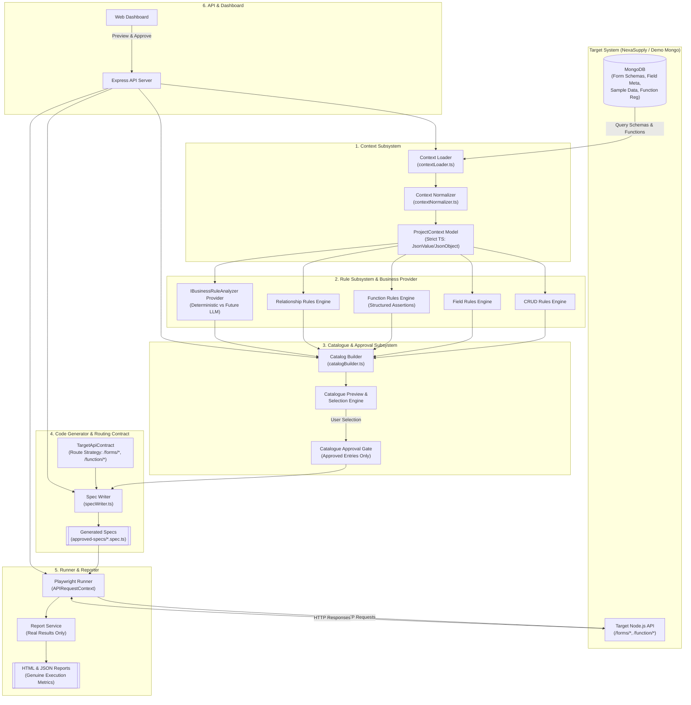

# Contextπ — System Architecture Specification (Updated & Refined)
**Project:** Contextπ  
**Problem Statement:** PS10 — Business-Context API Test Generation  
**Team:** T31 — SixthSense  

---

## 1. High-Level Architecture Overview

Contextπ is designed as a modular, single-application system built with Node.js and TypeScript in **Strict Mode** (`"strict": true`). Broad `any` types are removed and replaced with strict JSON types (`JsonValue`, `JsonObject`).

The system extracts dynamic metadata from MongoDB, applies a deterministic rule engine (supported by an extensible `IBusinessRuleAnalyzer` abstraction), builds a previewable **Test Catalogue**, enforces an explicit **Catalogue Selection & Approval Gate**, synthesizes executable Playwright TypeScript API test suites (`.spec.ts`) routed via a configurable `TargetApiContract`, programmatically executes tests against the target Node.js API (NexaSupply), and produces real execution reports.



---

## 2. Updated Core Data Domain Models (Strict TypeScript)

```typescript
// ==========================================
// 1. Strict JSON Standard Types
// ==========================================
export type JsonPrimitive = string | number | boolean | null;
export type JsonValue = JsonPrimitive | JsonObject | JsonArray;
export interface JsonObject { [key: string]: JsonValue; }
export type JsonArray = JsonValue[];

// ==========================================
// 2. Context Subsystem Domain Models
// ==========================================
export interface FieldMetadata {
  name: string;
  dataType: string;         // Normalized string value (e.g. 'String', 'Number', 'Boolean', 'Array', 'Object', 'Date', 'ObjectId', etc.)
  mandatoryField: boolean;
  inputType: string;        // Normalized string value (e.g. 'text', 'number', 'email', 'url', 'phone', 'select', 'multiselect', 'date', etc.)
  mappedTableRef?: string;  // Foreign key / reference entity name
  multipleSelect?: boolean;
  defaultValue?: JsonValue;
  enum?: JsonValue[];
}

export interface SchemaContext {
  schemaName: string;
  active: boolean;
  fields: FieldMetadata[];
  sampleRecord?: JsonObject;
}

export interface FunctionParameter {
  name: string;
  type: string;
  isActive: boolean;
  required: boolean;
}

export interface FunctionResponseField {
  name: string;
  type: string;
  required: boolean;
}

export interface FunctionContext {
  name: string;
  isActive: boolean;
  parameters: FunctionParameter[];
  expectedResponseFields: FunctionResponseField[];
}

export interface ProjectContext {
  projectName: string;
  schemas: SchemaContext[];
  functions: FunctionContext[];
  requirement?: string;
  sampleData?: Record<string, JsonObject[]>;
}

// ==========================================
// 3. Target API Contract / Route Strategy
// ==========================================
export interface TargetApiContract {
  baseUrl: string;
  formRoutes: {
    formGet: string;        // e.g. '/forms/formGet'
    formCreate: string;     // e.g. '/forms/formCreate'
    formUpdate: string;     // e.g. '/forms/formUpdate'
    formDelete: string;     // e.g. '/forms/formDelete'
    formBulkupload: string; // e.g. '/forms/formBulkupload'
    query: string;          // e.g. '/forms/query' or '/query'
  };
  functionRoutes: {
    executeFunction: string; // e.g. '/function/:name'
    createFunction: string;  // e.g. '/function/createfunction'
    getAllFunction: string;  // e.g. '/function/getAllfunction'
  };
}

// Default PS10 Route Strategy
export const DEFAULT_PS10_CONTRACT: TargetApiContract = {
  baseUrl: 'http://localhost:3000',
  formRoutes: {
    formGet: '/forms/formGet',
    formCreate: '/forms/formCreate',
    formUpdate: '/forms/formUpdate',
    formDelete: '/forms/formDelete',
    formBulkupload: '/forms/formBulkupload',
    query: '/forms/query'
  },
  functionRoutes: {
    executeFunction: '/function/:name',
    createFunction: '/function/createfunction',
    getAllFunction: '/function/getAllfunction'
  }
};

// ==========================================
// 4. Test Catalogue & Traceability Models
// ==========================================
export type TestCategory = 'CRUD' | 'FIELD_VALIDATION' | 'CUSTOM_FUNCTION' | 'RELATIONSHIP' | 'BUSINESS_RULE' | 'REGISTRY';
export type TestPriority = 'CRITICAL' | 'HIGH' | 'MEDIUM' | 'LOW';
export type RequirementSource = 'MONGO_SCHEMA' | 'FUNCTION_REGISTRY' | 'BUSINESS_REQUIREMENT';

export interface CatalogEntry {
  testId: string;
  category: TestCategory;
  targetEntity: string;
  description: string;
  source: RequirementSource;
  sourceRef: string;
  reasoning: string;
  expectedResult: {
    statusCode: number;
    responseBodySchema?: JsonObject;
    errorMessagePattern?: string;
  };
  priority: TestPriority;
  dependencies: string[];
  payloadTemplate: JsonObject;
  httpMethod: 'GET' | 'POST' | 'PUT' | 'PATCH' | 'DELETE';
  targetRouteKey: keyof TargetApiContract['formRoutes'] | keyof TargetApiContract['functionRoutes'];
  customUrlPath?: string;
  selected: boolean;       // Support catalogue select/deselect
}

export interface TestCatalog {
  projectName: string;
  createdAt: string;
  status: 'DRAFT' | 'APPROVED';
  entries: CatalogEntry[];
}

// ==========================================
// 5. Business Rule Provider Abstraction
// ==========================================
export interface BusinessRuleConstraint {
  ruleId: string;
  targetFieldOrEntity: string;
  constraintType: 'EXACT_DIGITS' | 'NOT_EMPTY' | 'GREATER_THAN' | 'LESS_THAN' | 'BETWEEN' | 'VALID_URL' | 'VALID_EMAIL' | 'ALLOWED_ENUM' | 'NON_NEGATIVE';
  parameters: JsonObject;
  reasoning: string;
}

export interface IBusinessRuleAnalyzer {
  analyzeRequirements(rawRequirementText: string, context: ProjectContext): Promise<BusinessRuleConstraint[]>;
}

// ==========================================
// 6. Real Execution Result Model
// ==========================================
export interface TestExecutionResult {
  testId: string;
  passed: boolean;
  durationMs: number;
  statusCodeReceived?: number;
  responseBody?: JsonValue;
  error?: string;
  traceability: CatalogEntry;
}

export interface ExecutionSummary {
  projectName: string;
  executedAt: string;
  totalExecuted: number;
  passed: number;
  failed: number;
  passRatePercentage: number;
  totalDurationMs: number;
  results: TestExecutionResult[];
}
```

---

## 3. Detailed Component Architecture

### 3.1 Business Rule Provider Abstraction (`src/rules/analyzers/`)
- **`IBusinessRuleAnalyzer.ts`**: Core interface defining `analyzeRequirements()`. Returns `BusinessRuleConstraint[]`.
- **`DeterministicBusinessRuleAnalyzer.ts`**: Phase 1 implementation. Uses regex and keyword parsing to deterministically convert plain text requirements into `BusinessRuleConstraint` objects.
- **`LLMBusinessRuleAnalyzer.ts` (Future Extension)**: Pluggable AI analyzer that queries LLM APIs (Gemini) to produce structured `BusinessRuleConstraint[]`.
- **CRITICAL DESIGN GUARD**: An LLM MUST NEVER generate Playwright TypeScript source code directly. The spec generator strictly renders code from approved `CatalogEntry` objects.

### 3.2 Target API Routing & Contract Layer (`src/contract/`)
- **`TargetApiContract.ts`**: Resolves logical route keys (e.g. `formCreate`, `executeFunction`) into actual URL paths (`/forms/formCreate`, `/function/:name`).
- Ensures Contextπ remains completely decoupled from NexaSupply schema and path assumptions.

### 3.3 Catalogue Approval State Engine (`src/catalogue/approval/`)
- Manages transition from `DRAFT` $\rightarrow$ `APPROVED`.
- Allows users to preview catalogue entries via REST/UI, toggle `selected` status for individual tests, and approve the finalized suite.
- Spec generator rejects code generation requests if catalogue status is `DRAFT` or entry is unselected (`selected === false`).

### 3.4 Spec Writer & Template Engine (`src/generator/`)
- Generates `.spec.ts` files solely from approved catalogue entries.
- Injects `TargetApiContract` endpoint paths into Playwright `request.newContext()` and `request.post() / request.get()` calls.
- Encodes dynamic response assertions (verifying structured response fields `FunctionResponseField`).

### 3.5 Genuine Execution & Report Service (`src/runner/`)
- Invokes Playwright test runner against generated specs.
- Captures genuine execution outputs from `APIRequestContext`.
- Guarantees zero hardcoded counts: `summary.json` and `report.html` are rendered exclusively from real Playwright run streams.
